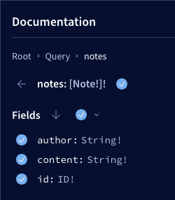
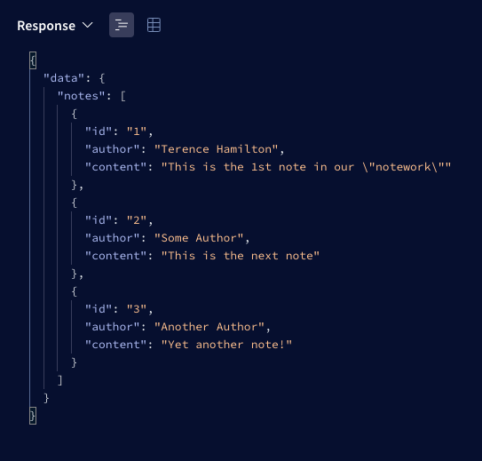

<!-- Improved compatibility of back to top link:
See: https://github.com/othneildrew/Best-README-Template/pull/73 -->

<a name="readme-top"></a>

<!--
*** Thanks for checking out the Best-README-Template. If you have a suggestion
*** that would make this better, please fork the repo and create a pull request
*** or simply open an issue with the tag "enhancement".
*** Don't forget to give the project a star!
*** Thanks again! Now go create something AMAZING! :D
-->

<!-- PROJECT SHIELDS -->
<!--
*** I'm using markdown "reference style" links for readability.
*** Reference links are enclosed in brackets [ ] instead of parentheses ( ).
*** See the bottom of this document for the declaration of the reference variables
*** for contributors-url, forks-url, etc. This is an optional, concise syntax you may use.
*** https://www.markdownguide.org/basic-syntax/#reference-style-links
-->

<!-- [![Contributors][contributors-shield]][contributors-url] -->
<!-- [![Forks][forks-shield]][forks-url] -->
<!-- [![Stargazers][stars-shield]][stars-url] -->

[![Issues][issues-shield]][issues-url]
[![MIT License][license-shield]][license-url]
[![LinkedIn][linkedin-shield]][linkedin-url]

<!-- PROJECT LOGO -->
<br />
<div align="center">
  <a href="https://blog.hamilton-labs.com/projects/notework">
    </img>
  </a>

  <h3 align="center">The Social NoteWork</h3>

  <p align="center">
    The Social NoteWork is a multi-platform, note-taking application with a 
    <em>social</em> aspect.
    <br />
    <a href="https://blog.hamilton-labs.com/projects/notework">
    <strong>Explore the docs »</strong></a>
    <br />
    <br />
    <a href="https://blog.hamilton-labs.com/projects/notework">View Demo</a> (Coming Soon)
    ·
    <a href="https://github.com/HamiltonMultimedia/The-Social-NoteWork/issues">Report Bug</a>
    ·
    <a href="https://github.com/othneildrew/Best-README-Template/issues">
    Request Feature</a>
  </p>
</div>

<!-- TABLE OF CONTENTS -->
<details>
  <summary>Table of Contents</summary>
  <ol>
    <li>
      <a href="#about-the-project">About The Project</a>
      <ul>
        <li><a href="#built-with">Built With</a></li>
      </ul>
    </li>
    <li>
      <a href="#getting-started">Getting Started</a>
      <ul>
        <li><a href="#prerequisites">Prerequisites</a></li>
        <li><a href="#installation">Installation</a></li>
      </ul>
    </li>
    <li><a href="#usage">Usage</a></li>
    <li><a href="#roadmap">Roadmap</a></li>
    <li><a href="#contributing">Contributing</a></li>
    <li><a href="#license">License</a></li>
    <li><a href="#contact">Contact</a></li>
    <li><a href="#acknowledgments">Acknowledgments</a></li>
  </ol>
</details>

<!-- ABOUT THE PROJECT -->

## About The Project

<!-- [![The Social NoteWork][product-screenshot]](/images/logo.png) -->

<p align="center"><a href="https://blog.hamilton-labs.com/projects/notework">
</img>
</a></p>

This logo was AI Generated with <a href="https://stablediffusionweb.com/" target="_blank" rel="noopener">Stable Diffusion Online</a>.

The Social NoteWork is a multi-platform, note-taking application with a social aspect. It has a Node.js runtime/server and 6 separate clients. Mobile [Web, Android & iPhone] and Desktop [Windows, Mac & Linux].

The clients:

- Android
- iOS
- Web
- Linux
- Mac
- Windows

I figured why stop at only one when we can target so many platforms so quickly?

Clone the repo and fire it up to get started.

<p align="right">(<a href="#readme-top">back to top</a>)</p>

### Built With

This projects is built with all of the latest versions of various frameworks & libraries used to bootstrap the project. I'll list the add-ons/plugins in the acknowledgements section below.

  

- [![Express][Express.js]][Express-url]
- [![GraphQL][GraphQL]][GraphQL-url]
- [![Apollo][Apollo]][Apollo-url]
- [![MongoDB][MongoDB]][MongoDB-url]
- [![React][React.js]][React-url]
- [![React Native][React Native]][React-Native-url]
- [![Electron][Electron]][Electron-url]
<!-- - [![Angular][Angular.io]][Angular-url]
- [![Svelte][Svelte.dev]][Svelte-url]
- [![Laravel][Laravel.com]][Laravel-url]
- [![Bootstrap][Bootstrap.com]][Bootstrap-url]
- [![JQuery][JQuery.com]][JQuery-url] -->

<p align="right">(<a href="#readme-top">back to top</a>)</p>

<!-- GETTING STARTED -->

## Getting Started

To set this project up locally and get a local copy up and running, follow these steps.

### Prerequisites

You will need the following installed and configured on your machine.

- [node.js](https://nodejs.org/en) (required)  
I recommend installing node with [nvm](https://github.com/nvm-sh/nvm?tab=readme-ov-file#installing-and-updating)  
  If you need help try this [guide](https://www.freecodecamp.org/news/node-version-manager-nvm-install-guide/)
  ```sh 
  curl -o- https://raw.githubusercontent.com/nvm-sh/nvm/v0.39.7/install.sh | bash
  ```
  or
  ```sh 
  wget -qO- https://raw.githubusercontent.com/nvm-sh/nvm/v0.39.7/install.sh | bash
  ```
- [pnpm](https://pnpm.io/installation#using-npm) 
  ```sh 
  npm install -g pnpm
  ```
  Another option is to [install](https://pnpm.io/installation#using-npm) node & pnpm with this
  ```sh 
  npm install -g @pnpm/exe
  ```
- [nx](https://nx.dev/)
  ```sh 
  pnpm add nx -D -w
  ```

### Installation

_Once you've installed and set your prerequisites up you can run the following commands._

1. Clone the repo
   ```sh
   git clone git@github.com:HamiltonMultimedia/The-Social-NoteWork.git
   ```
2. Install NPM packages
   ```sh
   pnpm install
   ```
3. Start your dev environment `package.js`
   ```sh
   pnpx nx dev tsn-gql-backend
   ```
4. Now head over to this address
   ```sh
   http://localhost:4000/api
   ```

<p align="right">(<a href="#readme-top">back to top</a>)</p>

<!-- USAGE EXAMPLES -->

## Usage

Once you've gone to the address mentioned in the previous section then you can test the query resolver out.

You can use the selector.  
  

Or type them out by hand.  
  

Then observe the response.  



_More [Documentation](https://blog.hamilton-labs.com/projects/notework) is coming soon_

<p align="right">(<a href="#readme-top">back to top</a>)</p>

<!-- ROADMAP -->

## Roadmap

- [x] Add [MongoDB](https://www.mongodb.com/) Database
- [ ] Add User Accounts and Authentication
  - [ ] User Sign up
  - [ ] User Sign in/out
  - [ ] User Auth Tokens (JWT)
- [ ] Add User Actions like:
  - [ ] Create Notes
  - [ ] Update Notes
  - [ ] Delete Notes
  - [ ] Mark Notes as Favorites
- [ ] Develop Mobile clients
  - [ ] Web (React)
  - [ ] Android (React Native)
  - [ ] iOS (React Native)
- [ ] Develop Desktop clients
  - [ ] Linux (Electron)
  - [ ] Windows (Electron)
  - [ ] Mac (Electron)

See the [open issues](https://github.com/othneildrew/Best-README-Template/issues) for a full list of proposed features (and known issues).

<p align="right">(<a href="#readme-top">back to top</a>)</p>

<!-- CONTRIBUTING -->

## Contributing

Contributions are what make the open source community such an amazing place to learn, inspire, and create. Any contributions you make are **greatly appreciated**.

If you have a suggestion that would make this better, please fork the repo and create a pull request. You can also simply open an issue with the tag "enhancement".
Don't forget to give the project a star! Thanks again!

1. Fork the Project
2. Create your Feature Branch (`git checkout -b feature/AmazingFeature`)
3. Commit your Changes (`git commit -m 'Add some AmazingFeature'`)
4. Push to the Branch (`git push origin feature/AmazingFeature`)
5. Open a Pull Request

<p align="right">(<a href="#readme-top">back to top</a>)</p>

<!-- LICENSE -->

## License

Distributed under the MIT License. See [`LICENSE.txt`](https://github.com/HamiltonMultimedia/The-Social-NoteWork/blob/main/LICENSE) for more information.

<p align="right">(<a href="#readme-top">back to top</a>)</p>

<!-- CONTACT -->

## Contact

LinkedIn: [in/terence-hamilton](https://www.linkedin.com/in/terence-hamilton/) - Twitter: [@Hamilton_TPJ](https://twitter.com/Hamilton_TPJ)

Project Link: [The Social NoteWork](https://github.com/HamiltonMultimedia/The-Social-NoteWork)

<p align="right">(<a href="#readme-top">back to top</a>)</p>

<!-- ACKNOWLEDGMENTS -->

## Acknowledgments

Use this space to list resources you find helpful and would like to give credit to. I've included a few of my favorites to kick things off!

- [JavaScript Everywhere by Adam D. Scott](https://www.oreilly.com/library/view/javascript-everywhere/9781492046974/)
- [othneildrew's Best-README-Template](https://github.com/othneildrew/Best-README-Template)
- [GitHub Emoji Cheat Sheet](https://www.webpagefx.com/tools/emoji-cheat-sheet)
- [Malven's Flexbox Cheatsheet](https://flexbox.malven.co/)
- [Malven's Grid Cheatsheet](https://grid.malven.co/)
- [Img Shields](https://shields.io)
- [GitHub Pages](https://pages.github.com)
- [Font Awesome](https://fontawesome.com)
- [React Icons](https://react-icons.github.io/react-icons/search)

<p align="right">(<a href="#readme-top">back to top</a>)</p>

<!-- MARKDOWN LINKS & IMAGES -->
<!-- https://www.markdownguide.org/basic-syntax/#reference-style-links -->

[contributors-shield]: https://img.shields.io/github/contributors/othneildrew/Best-README-Template.svg?style=for-the-badge
[contributors-url]: https://github.com/othneildrew/Best-README-Template/graphs/contributors
[forks-shield]: https://img.shields.io/github/forks/othneildrew/Best-README-Template.svg?style=for-the-badge
[forks-url]: https://github.com/othneildrew/Best-README-Template/network/members
[stars-shield]: https://img.shields.io/github/stars/othneildrew/Best-README-Template.svg?style=for-the-badge
[stars-url]: https://github.com/othneildrew/Best-README-Template/stargazers
[issues-shield]: https://img.shields.io/github/issues/HamiltonMultimedia/The-Social-NoteWork?style=for-the-badge&logo=github&color=yellow&link=https%3A%2F%2Fgithub.com%2FHamiltonMultimedia%2FThe-Social-NoteWork%2Fissues

[issues-url]: https://github.com/HamiltonMultimedia/The-Social-NoteWork/issues
[license-shield]: https://img.shields.io/github/license/HamiltonMultimedia/The-Social-NoteWork?style=for-the-badge&label=LICENSE&color=green&link=https%3A%2F%2Fgithub.com%2FHamiltonMultimedia%2FThe-Social-NoteWork%2Fblob%2Fmain%2FLICENSE
[license-url]: https://github.com/HamiltonMultimedia/The-Social-NoteWork/blob/main/LICENSE
[linkedin-shield]: https://img.shields.io/badge/LinkedIn-blue?style=for-the-badge&logo=linkedin&color=blue
[linkedin-url]: https://www.linkedin.com/in/terence-hamilton/
[product-screenshot]: images/logo.png
[Next.js]: https://img.shields.io/badge/next.js-000000?style=for-the-badge&logo=nextdotjs&logoColor=white
[Express.js]: https://img.shields.io/badge/Express-white?style=for-the-badge&logo=Express&logoColor=black

[Express-url]: https://expressjs.com/
[Next-url]: https://nextjs.org/
[React.js]: https://img.shields.io/badge/React-20232A?style=for-the-badge&logo=react&logoColor=61DAFB
[React Native]: https://img.shields.io/badge/React_Native-20232A?style=for-the-badge&logo=react&logoColor=61DAFB
[Electron-url]: https://www.electronjs.org/
[Electron]: https://img.shields.io/badge/Electron-white?style=for-the-badge&logo=Electron&logoColor=%2375F3F9&color=272838

[GraphQL]: https://img.shields.io/badge/GraphQL-white?style=for-the-badge&logo=GraphQL&color=hotpink

[GraphQL-url]: https://graphql.org/
[React-url]: https://reactjs.org/
[React-Native-url]: https://reactnative.dev/
[MongoDB]: https://img.shields.io/badge/MongoDB-white?style=for-the-badge&logo=Mongodb&color=darkgreen
[MongoDB-url]: https://www.mongodb.com/

[Apollo]: https://img.shields.io/badge/Apollo-white?style=for-the-badge&logo=Apollo%20GraphQL&color=purple

[Apollo-url]: https://www.apollographql.com/
[Angular.io]: https://img.shields.io/badge/Angular-DD0031?style=for-the-badge&logo=angular&logoColor=white
[Angular-url]: https://angular.io/
[Svelte.dev]: https://img.shields.io/badge/Svelte-4A4A55?style=for-the-badge&logo=svelte&logoColor=FF3E00
[Svelte-url]: https://svelte.dev/
[Laravel.com]: https://img.shields.io/badge/Laravel-FF2D20?style=for-the-badge&logo=laravel&logoColor=white
[Laravel-url]: https://laravel.com
[Bootstrap.com]: https://img.shields.io/badge/Bootstrap-563D7C?style=for-the-badge&logo=bootstrap&logoColor=white
[Bootstrap-url]: https://getbootstrap.com
[JQuery.com]: https://img.shields.io/badge/jQuery-0769AD?style=for-the-badge&logo=jquery&logoColor=white
[JQuery-url]: https://jquery.com
