<!-- Improved compatibility of back to top link:
See: https://github.com/othneildrew/Best-README-Template/pull/73 -->

<a name="readme-top"></a>

<!--
*** Thanks for checking out the Best-README-Template. If you have a suggestion
*** that would make this better, please fork the repo and create a pull request
*** or simply open an issue with the tag "enhancement".
*** Don't forget to give the project a star!
*** Thanks again! Now go create something AMAZING! :D
-->

<!-- PROJECT LOGO -->
<br />
<div align="center">
  <a href="https://blog.hamilton-labs.com/projects/notework">
    </img>
  </a>

  <h3 align="center">The Social NoteWork</h3>

  <p align="center">
    The Social NoteWork is a multi-platform, note-taking application with a
    <em>social</em> aspect.
    <br />
    <a href="https://blog.hamilton-labs.com/projects/notework">
    <strong>Explore the docs »</strong></a>
    <br />
    <br />
    <a href="https://blog.hamilton-labs.com/projects/notework">View Demo</a> (Coming Soon)
    ·
    <a href="https://github.com/HamiltonMultimedia/The-Social-NoteWork/issues">Report Bug</a>
    ·
    <a href="https://github.com/othneildrew/Best-README-Template/issues">
    Request Feature</a>
  </p>
</div>

<!-- PROJECT SHIELDS -->
<!--
*** I'm using markdown "reference style" links for readability.
*** Reference links are enclosed in brackets [ ] instead of parentheses ( ).
*** See the bottom of this document for the declaration of the reference variables
*** for contributors-url, forks-url, etc. This is an optional, concise syntax you may use.
*** https://www.markdownguide.org/basic-syntax/#reference-style-links
-->

[![Stargazers][stars-shield]][stars-url]
[![Issues][issues-shield]][issues-url]
[![MIT License][license-shield]][license-url]
[![LinkedIn][linkedin-shield]][linkedin-url]
[![Forks][forks-shield]][forks-url]
[![Contributors][contributors-shield]][contributors-url]
[![Build][build-shield]][build-url]

<!-- TABLE OF CONTENTS -->
<details>
  <summary>Table of Contents</summary>
  <ol>
    <li>
      <a href="#about-the-project">About The Project</a>
      <ul>
        <li><a href="#built-with">Built With</a></li>
      </ul>
    </li>
    <li>
      <a href="#getting-started">Getting Started</a>
      <ul>
        <li><a href="#prerequisites">Prerequisites</a></li>
        <li><a href="#installation">Installation</a></li>
      </ul>
    </li>
    <li><a href="#usage">Usage</a></li>
    <li><a href="#roadmap">Roadmap</a></li>
    <li><a href="#contributing">Contributing</a></li>
    <li><a href="#license">License</a></li>
    <li><a href="#contact">Contact</a></li>
    <li><a href="#acknowledgments">Acknowledgments</a></li>
  </ol>
</details>

<!-- ABOUT THE PROJECT -->

## About The Project

<!-- [![The Social NoteWork][product-screenshot]](/images/logo.png) -->

<p align="center"><a href="https://blog.hamilton-labs.com/projects/notework">
</img>
</a></p>

_This logo was AI Generated by <a href="https://stablediffusionweb.com/" target="_blank" rel="noopener">Stable Diffusion Online</a>._

To learn more about the inspriation for this project see the [blog post](https://blog.hamilton-labs.com/projects/notework).

The Social NoteWork is a multi-platform, note-taking application with a social aspect. It has a Node.js runtime/server and 6 separate clients.

The clients:

- Android 🦾
- iOS 📱
- Web 🌐
- Linux 🐧
- Mac 🍏
- Windows 🪟

I figured why stop at only one when we can target so many platforms so quickly?

Clone the repo and fire it up to get started. 🚀

<p align="right">(<a href="#readme-top">back to top</a>)</p>

## My Stack

This project is built with all of the latest versions of various frameworks & libraries used to bootstrap the project. I'll list additional add-ons/plugins in the acknowledgements section below.

- [![Express][Express.js]][Express-url]
- [![GraphQL][GraphQL]][GraphQL-url]
- [![Apollo][Apollo]][Apollo-url]
- [![MongoDB][MongoDB]][MongoDB-url]
- [![JWT][JWT]][JWT-url]
- [![Expo][Expo]][Expo-url]
- [![React][React.js]][React-url]
- [![React Native][React Native]][React-Native-url]
- [![Electron][Electron]][Electron-url]
- [![ESbuild][ESbuild]][ESbuild-url]
- [![TypeScript][TypeScript]][TypeScript-url]

<!-- - [![Angular][Angular.io]][Angular-url]
- [![Svelte][Svelte.dev]][Svelte-url]
- [![Laravel][Laravel.com]][Laravel-url]
- [![Bootstrap][Bootstrap.com]][Bootstrap-url]
- [![JQuery][JQuery.com]][JQuery-url] -->

<p align="right">(<a href="#readme-top">back to top</a>)</p>

<!-- GETTING STARTED -->

## Getting Started

To set this project up locally and get a local copy up and running, follow these steps.

### Prerequisites

You will need the following installed and configured on your machine.

- [node.js](https://nodejs.org/en) (required)  
  I recommend installing node with [nvm](https://github.com/nvm-sh/nvm?tab=readme-ov-file#installing-and-updating)  
   If you need help try this [guide](https://www.freecodecamp.org/news/node-version-manager-nvm-install-guide/)

  ```sh
  curl -o- https://raw.githubusercontent.com/nvm-sh/nvm/v0.39.7/install.sh | bash
  ```

  or

  ```sh
  wget -qO- https://raw.githubusercontent.com/nvm-sh/nvm/v0.39.7/install.sh | bash
  ```

- [pnpm](https://pnpm.io/installation#using-npm)

  ```sh
  npm install -g pnpm
  ```

  Another option is to [install](https://pnpm.io/installation#using-npm) node & pnpm with this

  ```sh
  npm install -g @pnpm/exe
  ```

- [nx](https://nx.dev/)

  ```sh
  pnpm add nx -D -w
  ```

### Commit Signing Key (Required)

Configure your [verified](https://docs.github.com/en/authentication/managing-commit-signature-verification/displaying-verification-statuses-for-all-of-your-commits) commit siging key.

I recommend following these [instructions](https://docs.github.com/en/authentication/managing-commit-signature-verification/telling-git-about-your-signing-key#telling-git-about-your-ssh-key) to use your current SSH key for signing commits, if you havent already configured this.

If not, you could use these [instrutions](https://docs.github.com/en/authentication/connecting-to-github-with-ssh/generating-a-new-ssh-key-and-adding-it-to-the-ssh-agent) to generate a separate SSH key, add it to your GitHub account [as a signing key](https://github.com/orgs/community/discussions/40047#discussioncomment-4234972), and then use it for [signing your commits](https://docs.github.com/en/authentication/managing-commit-signature-verification/telling-git-about-your-signing-key#telling-git-about-your-ssh-key).

Optionally, you could sign all of your commits with this.

```sh
  git config --global commit.gpgsign true
```

If you use 1Password this [video](https://youtu.be/BMFvhl0WRFQ?si=YyriDAjOmNSnhBtS) and this [guide](https://developer.1password.com/docs/ssh/git-commit-signing/) could also be options.

### MongoDB (Required)

You will need access to a Mongo database.

You have options:

- Local installation [guide](https://www.mongodb.com/docs/manual/installation/)
- Remote set up with MongoDB Atlas [guide](https://www.mongodb.com/docs/atlas/tutorial/deploy-free-tier-cluster/)

Pick one, set it up and continue.

### Installation

_Once you've installed and set your prerequisites up you can run the following commands._

1. Clone the repo.

   ```sh
   git clone git@github.com:HamiltonMultimedia/The-Social-NoteWork.git
   ```

2. Install NPM packages for the backend.

   ```sh
   cd The-Social-NoteWork/apps/backend/ && pnpm install
   ```

3. Start your dev environment from [`package.js`](https://github.com/HamiltonMultimedia/The-Social-NoteWork/blob/main/apps/backend/package.json).

   ```sh
   pnpx nx dev tsn-gql-backend
   ```

   If you get the error _"Unable to create nodes for pnpm-lock.yaml using plugin nx-js-graph-plugin."_  
    It's related to a known [issue](https://github.com/nrwl/nx/issues/15642) with [nx](https://nx.dev/ci/recipes/set-up).  
    Run the command below and try again.👇🏾

   ```sh
   touch node_modules/.modules.yaml
   ```

4. Now head over to this address.

   ```sh
   http://localhost:4000/api
   ```

<p align="right">(<a href="#readme-top">back to top</a>)</p>

<!-- USAGE EXAMPLES -->

## Usage

Once you've gone to the address mentioned in the previous section then you can test the resolver out in your browser.  
These tests will be automated soon.

### Queries

You can use the selector to draft your query request.  
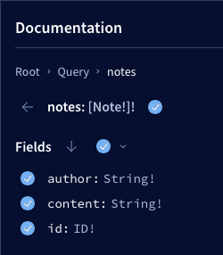

Or type them out by hand.  
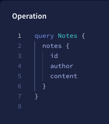

Then observe the response.  
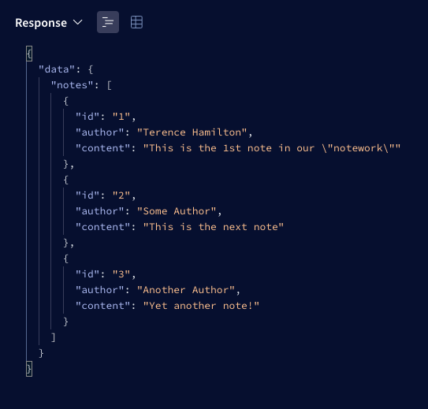  

### Mutations

_Create notes with the selector and select the fields you want, optionally._  
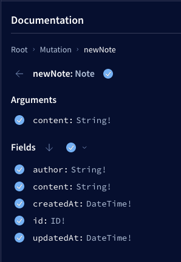

_Create them with a custom request that contains a variable._  
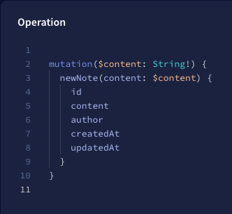

_Create request with a custom variable._  
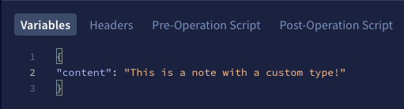

_See the response._  
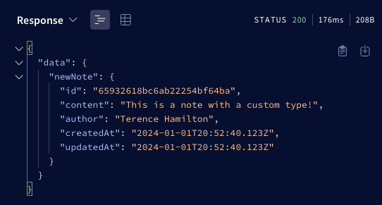

_Draft a note update request in the GUI._  
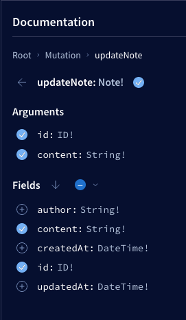

_Update note with a custom mutation request._  
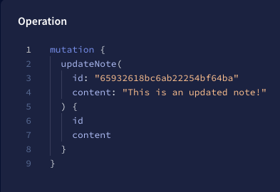

_GraphQL responds with your updated note._  
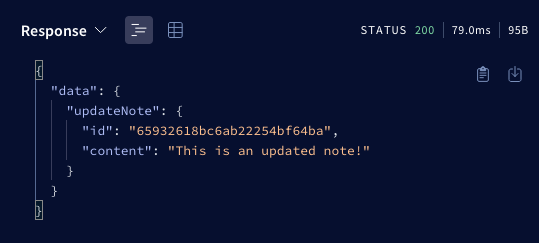

_Delete your note with the GUI's request selector._  
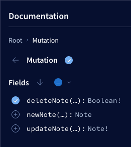

_Delete your note with a customized request. (Note ID required)_  
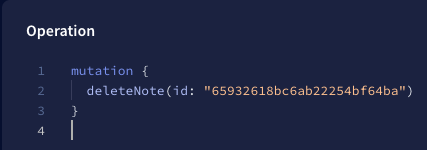

_See the response of your delete request._  
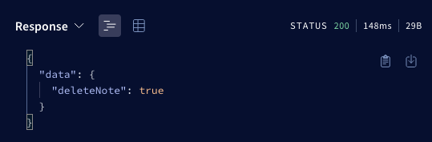

_More [Documentation](https://blog.hamilton-labs.com/projects/notework) is coming soon_

<p align="right">(<a href="#readme-top">back to top</a>)</p>

<!-- ROADMAP -->

## Roadmap

- [x] Add [MongoDB](https://www.mongodb.com/) Database
  - [x] Implement [ODM](https://www.mongodb.com/docs/drivers/node/current/#object-document-mappers) interface via [Mongoose](https://mongoosejs.com/docs/)
- [x] Add User Actions:
  - [x] Create Notes
  - [x] Read Notes
  - [x] Update Notes
  - [x] Delete Notes
  - [x] Mark Notes as Favorites
- [X] Add User Accounts and Authentication
  - [X] User Sign up
  - [X] User Sign in
  - [ ] User Sign out
  - [X] User Auth Tokens ([JWT](https://jwt.io/))
- [X] Link Users to their Notes  
  - [X] User Permissions for Updates & Deletes
  - [X] User Queries
  - [X] Nested Queries
  - [X] Toggling Note Favorites
- [X] Added Details:
  - [X] Pagination
  - [X] Data limits
  - [X] Helmet Security
  - [X] Apollo 4's GraphQL Error Handlers
- [ ] Develop Mobile clients
  - [ ] Web ([React](https://reactjs.org/))
  - [ ] Android (React Native - [Expo](https://expo.dev/))
  - [ ] iOS (React Native - [Expo](https://expo.dev/))
- [ ] Develop Desktop clients
  - [ ] Linux ([Electron](https://www.electronjs.org/))
  - [ ] Windows ([Electron](https://www.electronjs.org/))
  - [ ] Mac ([Electron](https://www.electronjs.org/))

See the [open issues](https://github.com/HamiltonMultimedia/The-Social-NoteWork/issues) for a full list of proposed features (and known issues).

<p align="right">(<a href="#readme-top">back to top</a>)</p>

<!-- CONTRIBUTING -->

## Contributing

Contributions are what make the open source community such an amazing place to learn, inspire, and create. Any contributions you make are **greatly appreciated**.

If you have a suggestion that would make this better, please fork the repo and create a pull request. You can also simply open an issue with the tag "enhancement".
Don't forget to give the project a star! Thanks again!

1. Fork the Project
2. Create your Feature Branch (`git checkout -b feature/AmazingFeature`)
3. Lint pick your code (`pnpm nx run tsn-gql-backend:lint:production --skip-nx-cache`)
4. Commit your Changes (`git commit -m 'Add some AmazingFeature'`)
5. Push to the Branch (`git push origin feature/AmazingFeature`)
6. Open a Pull Request

<p align="right">(<a href="#readme-top">back to top</a>)</p>

<!-- LICENSE -->

## License

Distributed under the MIT License. See [`LICENSE.txt`](https://github.com/HamiltonMultimedia/The-Social-NoteWork/blob/main/LICENSE) for more information.

<p align="right">(<a href="#readme-top">back to top</a>)</p>

<!-- CONTACT -->

## Contact

LinkedIn: [in/terence-hamilton](https://www.linkedin.com/in/terence-hamilton/) - Twitter: [@Hamilton_TPJ](https://twitter.com/Hamilton_TPJ)

Project Link: [The Social NoteWork](https://github.com/HamiltonMultimedia/The-Social-NoteWork)

<p align="right">(<a href="#readme-top">back to top</a>)</p>

<!-- ACKNOWLEDGMENTS -->

## Acknowledgments

Here are some resources I found helpful and would like to give thanks and credit to.

- [JavaScript Everywhere by Adam D. Scott](https://www.oreilly.com/library/view/javascript-everywhere/9781492046974/)
- [othneildrew's Best-README-Template](https://github.com/othneildrew/Best-README-Template)
- [GitHub Emoji Cheat Sheet](https://www.webpagefx.com/tools/emoji-cheat-sheet)
- [Malven's Flexbox Cheatsheet](https://flexbox.malven.co/)
- [Malven's Grid Cheatsheet](https://grid.malven.co/)
- [Img Shields](https://shields.io)
- [GitHub Pages](https://pages.github.com)
- [Font Awesome](https://fontawesome.com)
- [React Icons](https://react-icons.github.io/react-icons/search)

<p align="right">(<a href="#readme-top">back to top</a>)</p>

<!-- MARKDOWN LINKS & IMAGES -->
<!-- https://www.markdownguide.org/basic-syntax/#reference-style-links -->

[stars-shield]: https://img.shields.io/github/stars/HamiltonMultimedia/The-Social-NoteWork?style=for-the-badge
[stars-url]: https://github.com/HamiltonMultimedia/The-Social-NoteWork/stargazers
[issues-shield]: https://img.shields.io/github/issues/HamiltonMultimedia/The-Social-NoteWork?style=for-the-badge&logo=github&color=yellow&link=https%3A%2F%2Fgithub.com%2FHamiltonMultimedia%2FThe-Social-NoteWork%2Fissues
[issues-url]: https://github.com/HamiltonMultimedia/The-Social-NoteWork/issues
[license-shield]: https://img.shields.io/github/license/HamiltonMultimedia/The-Social-NoteWork?style=for-the-badge&label=LICENSE&color=green&link=https%3A%2F%2Fgithub.com%2FHamiltonMultimedia%2FThe-Social-NoteWork%2Fblob%2Fmain%2FLICENSE
[license-url]: https://github.com/HamiltonMultimedia/The-Social-NoteWork/blob/main/LICENSE
[linkedin-shield]: https://img.shields.io/badge/LinkedIn-blue?style=for-the-badge&logo=linkedin&color=blue
[linkedin-url]: https://www.linkedin.com/in/terence-hamilton/
[forks-shield]: https://img.shields.io/github/forks/HamiltonMultimedia/The-Social-NoteWork?style=for-the-badge&logo=forgejo&logoColor=white&color=darkorange
[forks-url]: https://github.com/HamiltonMultimedia/The-Social-NoteWork/forks
[contributors-shield]: https://img.shields.io/github/contributors/HamiltonMultimedia/The-Social-NoteWork?style=for-the-badge&color=darkred
[contributors-url]: https://github.com/HamiltonMultimedia/The-Social-NoteWork/graphs/contributors
[build-shield]: https://img.shields.io/github/actions/workflow/status/HamiltonMultimedia/The-Social-NoteWork/lint.yml?style=for-the-badge

[build-url]: https://github.com/HamiltonMultimedia/The-Social-NoteWork/actions

[Express.js]: https://img.shields.io/badge/Express-white?style=for-the-badge&logo=Express&logoColor=black
[Express-url]: https://expressjs.com/
[React.js]: https://img.shields.io/badge/React-20232A?style=for-the-badge&logo=react&logoColor=61DAFB
[React Native]: https://img.shields.io/badge/React_Native-20232A?style=for-the-badge&logo=react&logoColor=61DAFB
[Electron-url]: https://www.electronjs.org/
[Electron]: https://img.shields.io/badge/Electron-white?style=for-the-badge&logo=Electron&logoColor=%2375F3F9&color=272838
[ESbuild-url]: https://esbuild.github.io/
[ESbuild]: https://img.shields.io/badge/ESbuild-yellow?style=for-the-badge&logo=esbuild&logoColor=black&link=https%3A%2F%2Fesbuild.github.io%2F
[TypeScript-url]: https://www.typescriptlang.org/
[TypeScript]: https://img.shields.io/badge/TypeScript-blue?style=for-the-badge&logo=TypeScript&logoColor=white&link=https%3A%2F%2Fwww.typescriptlang.org%2F
[GraphQL]: https://img.shields.io/badge/GraphQL-white?style=for-the-badge&logo=GraphQL&color=hotpink
[GraphQL-url]: https://graphql.org/
[React-url]: https://reactjs.org/
[React-Native-url]: https://reactnative.dev/
[MongoDB]: https://img.shields.io/badge/Mongo--DB-white?style=for-the-badge&logo=Mongodb&color=darkgreen
[MongoDB-url]: https://www.mongodb.com/
[JWT]: https://img.shields.io/badge/JWT-white?style=for-the-badge&logo=jsonwebtokens&logoColor=hotpink&color=black
[JWT-url]: https://jwt.io/
[Expo]: https://img.shields.io/badge/Expo-black?style=for-the-badge&logo=Expo
[Expo-url]: https://expo.dev/
[Apollo]: https://img.shields.io/badge/Apollo-white?style=for-the-badge&logo=Apollo%20GraphQL&color=purple
[Apollo-url]: https://www.apollographql.com/
